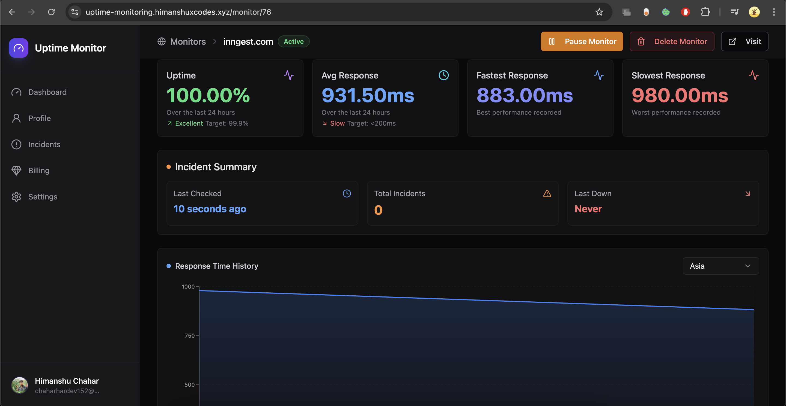

# 📡 **Uptime Monitoring**

> **Note:** Re-uploaded after deleting the original repository due to an accidental commit made using my company's laptop and email, which raised internal security concerns.

---

## 📝 Overview

**Uptime Monitoring** is a scalable web application designed to monitor the availability of registered websites in real-time. Users can onboard, add their websites, and receive alerts if any monitored site goes down.

---

## 🏗️ Architecture

This project consists of **two servers** working in synchronization:

1. **Next.js Server**  
   - Handles user onboarding, authentication, website registration, and user interactions.  
   - Acts as the frontend and API layer for user management and configuration.

2. **Main Backend Server ( worker )**  
   - Responsible for continuously checking the uptime status of registered websites.  
   - Performs monitoring tasks and triggers alerts when downtime is detected. 


You can find the backend repo here:  
[https://github.com/chaharhimanshu1004/uptime-worker-backend](https://github.com/chaharhimanshu1004/uptime-worker-backend)

---

## ⚙️ Tech Stacks

1. Next.js  
2. NextAuth.js (for authentication)  
3. Prisma ORM 
4. Redis

---

## 📷 Project Snapshot





---


## 🚀 Getting Started

To run the Next.js server locally:

```bash
npm install
npm run dev
# or
yarn install
yarn dev
